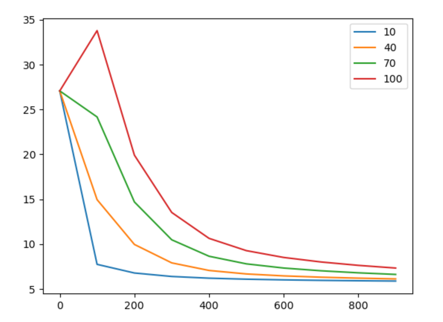
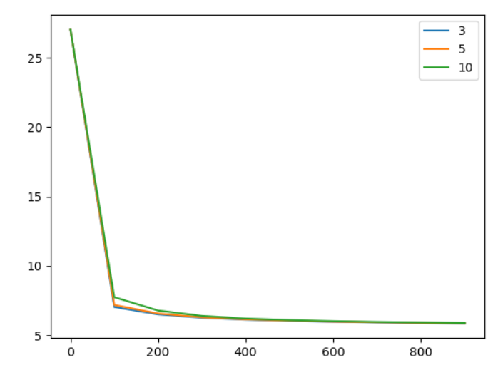
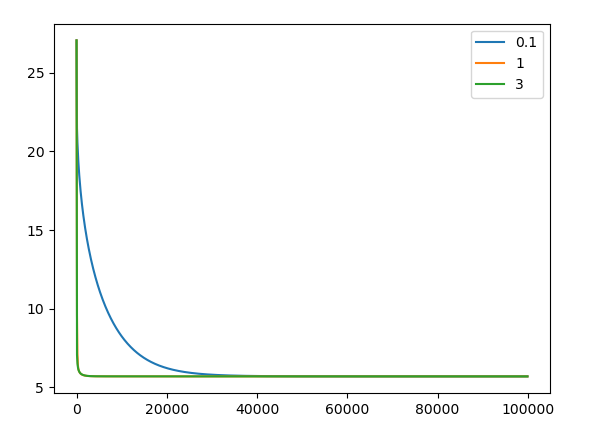
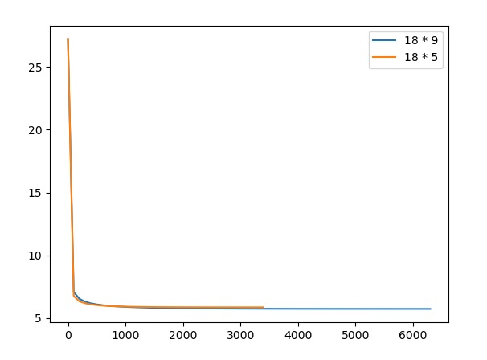
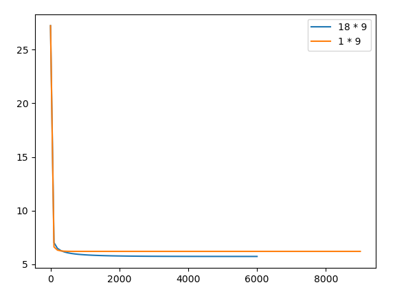

## Task Description

linear regression 预测出 PM2.5 的数值。

本次作业使用丰原站的观测记录，分成 train set 跟 test set，train set 是丰原站每个月的前 20 天所有数据。test set 则是从丰原站剩下的资料中取样出来。

- train.csv: 每个月前 20 天的完整数据。
- test.csv : 从剩下的数据当中取样出连续的 10 小时为一笔，前九小时的所有观测数据当作 feature，第十小时的 PM2.5 当作 answer。一共取出 240 笔不重复的 test data，请根据 feature 预测这 240 笔的 PM2.5。
- Data 含有 18 项观测数据 AMB_TEMP, CH4, CO, NHMC, NO, NO2, NOx, O3, PM10, PM2.5, RAINFALL, RH, SO2, THC, WD_HR, WIND_DIREC, WIND_SPEED, WS_HR。  

Link: https://www.kaggle.com/c/ml2020spring-hw1

预测 240 笔 testing data 中的 PM2.5 值，并将预测结果上传至 Kaggle

Upload format : csv file

- 第一行必须是 id,value
- 第二行开始，每行分别为 id 值及预测 PM2.5 数值，以逗号隔开。

### 备注

a. 1~3题的回答中，NR 请皆设为 0，其他的数值不要做任何更动。

b. 可以使用所有 advanced 的 gradient descent 技术（如 Adam、Adagrad）。

c. 1~3题请用linear regression的方法进行讨论作答。

##  Report

1. (2%) 使用四种不同的 learning rate 进行 training (其他参数需一致)，作图并讨论其收敛过程（横轴为 iteration 次数，纵轴为 loss 的大小，四种 learning rate 的收敛线请以不同颜色呈现在一张图里做比较）。

   

   

2. (1%) 比较取前 5 hrs 和前 9 hrs 的资料（5\*18 + 1 v.s 9*18 + 1）在 validation set 上预测的结果，并说明造成的可能原因（9hr:取前9小时预测第10小时的PM2.5；5hr:在前面的那些features中，以5~9hr预测第10小时的PM2.5。这样两者在相同的validation set比例下，会有一样笔数的数据）。

   > 9h
   >
   > loss on train : 5.721487540098176
   >
   > loss on valid : 5.664393698607878
   >
   > 5h
   >
   > loss on train : 5.8516381630320256
   >
   > loss on valid : 5.724209623852424
   >
   > 9h相比5h，loss更小，因为数据增多了？模型更加准确

   

3. (1%) 比较只取前 9 hrs 的 PM2.5 和取所有前 9 hrs 的 features（9\*1 + 1 vs. 9*18 + 1）在 validation set上预测的结果，并说明造成的可能原因。

   > loss on valid: 8900: 5.86109358926687
   > loss on train: 9000: 6.194031358522437
   > loss on valid increase, break 9000: 5.86109358926687
   >
   > loss on valid:5900:5.66448001690617
   > loss on train:6000:5.721472131593658
   > loss on valid increase, break6000:5.664480449223864
   >
   > 1个特征的loss会比18个特征loss要大，因为信息更多，但是差距不大，不显著

   

4. (2%) 请说明你超越 baseline 的 model(最后选择在Kaggle上提交的) 是如何实作的（例如：怎么进行 feature selection, 有没有做 pre-processing、learning rate 的调整、advanced gradient descent 技术、不同的 model 等等）。

   > lr = 4
   >
   > validation set = 20%
   >
   > adagrad
   >
   > Private Score = 7.59941
   >
   > Public Score = 5.48253

## Kaggle

在kaggle上的结果(评判标准是rmse)：

- simple_baseline = 8.73773
- strong_baseline = 7.14231
- private score为7.49105对应的排名为257/423
- keras搭建神经网络造成的overfitting比较明显，手写linear model的gradient descent的performance会比较好(data不是很多的情况下)
- 可以做进一步的特征工程

|         method         | Public Score | Private Score |
| :--------------------: | :----------: | :-----------: |
|  predict_adagrad_new   |   5.45971    |    7.49105    |
|    predict_adagrad     |   5.45813    |    7.50907    |
|      predict_adam      |   5.61442    |    7.67992    |
| predict_keras_all_data |   6.23082    |   11.32828    |
|     predict_keras      |   6.26881    |    7.93896    |