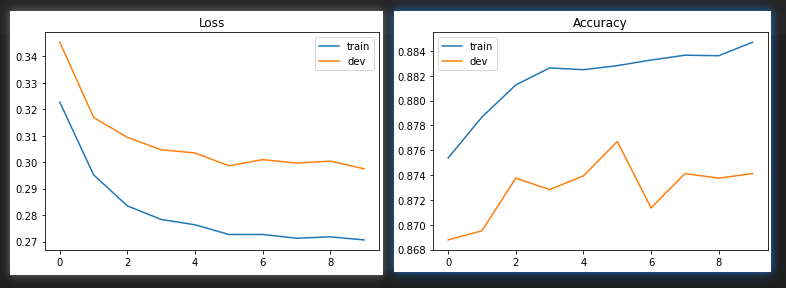
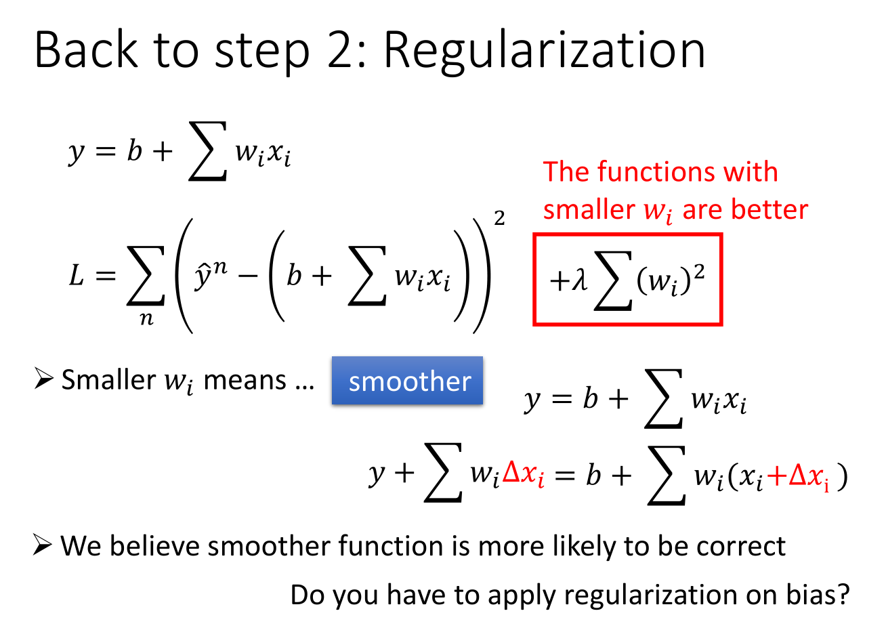

## Task Description

Task: Binary Classification

whether the income of an individual exceeds $50000 or not?

Dataset: [Census-Income (KDD) Dataset](https://archive.ics.uci.edu/ml/datasets/Census-Income+(KDD))

- remove unnecessary attributes and,
- balance the ratio between positively and negatively labeled data.

Feature Format

train.csv, test_no_label.csv

- text-based raw data
- unnecessary attributes removed, positive/negative ratio balanced.

X_train, Y_train, X_test

- discrete features in train.csv => one-hot encoding in X_train (education, martial state...)
- continuous features in train.csv => remain the same in X_train (age, capital losses...).
- X_train, X_test : each row contains one 510-dim feature represents a sample.
- Y_train: label = 0 means  “<= 50K” 、 label = 1 means  “ >50K ”

Kaggle competition: https://www.kaggle.com/c/ml2020spring-hw2

Public simple baseline(1%): 0.88617

Public strong baseline(1%): 0.89052

Private baselines(2%)

##  Report

1. (2%) 请比较实作的 generative model 及 logistic regression 的准确率，何者较佳？ 请解释为何有这种情况？

   > 逻辑回归
   >
   > Training loss: 0.27060297037387315 
   >
   > Development loss: 0.2974835612266556 
   >
   > Training accuracy: 0.8847020274421462 
   >
   > Development accuracy: 0.8741245853298931
   >
   > Generative Model
   >
   > Training accuracy: 0.8721431731052787
   >
   > 生成模型准确率较低，因为Generative的model它有做了某些假设，假设你的data来自于某个概率模型；而Discriminative的model是完全不作任何假设的
   >
   > 

2. (2%) 请实作 logistic regression 的正规化 (regularization)，并讨论其对于你的模型准确率的影响。接着尝试对正规项使用不同的权重 (lambda)，并讨论其影响。(有关 regularization 请参考 Regression p.35)

   > 
   >
   > 
   >

3. (1%) 请说明你实作的 best model，其训练方式和准确率为何？

   >  
   > 

4. (1%) 请实作输入特征标准化 (feature normalization)，并比较是否应用此技巧，会对于你的模型有何影响。

   >  
   >

   

## Kaggle

在kaggle上的结果(评判标准是Categorization Accuracy)：

- private score为0.89110对应的排名是99/285
- 手写linear的cross entropy的gradient descent的performance往往会比用keras写神经网络要来的好
- 特征工程是进一步优化的思路

|       method        | Public Score | Private Score |
| :-----------------: | :----------: | :-----------: |
| predict_adagrad_gd  |   0.88878    |    0.89110    |
| predict_adagrad_gd  |   0.88929    |    0.89052    |
| predict_adagrad_sgd |   0.88842    |    0.88863    |
|    predict_keras    |   0.88769    |    0.88900    |
|    predict_keras    |   0.88798    |    0.88675    |