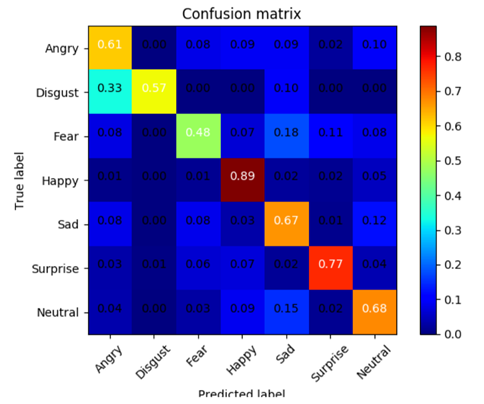

## Task Description

Task: Food Classification

此次数据集为网络上搜集到的食物照片，共有11类

Bread, Dairy product, Dessert, Egg, Fried food, Meat, Noodles/Pasta, Rice, Seafood, Soup, and Vegetable/Fruit.

Training set: 9866张

Validation set: 3430张

Testing set: 3347张

下载 zip 档后解压缩会有三个文件夹，分别为training、validation 以及 testing

training 以及 validation 中的照片名称格式为 [类别]_[编号].jpg，例如 3_100.jpg 即为类别 3 的照片（编号不重要）

testing 中的照片名称格式为 [编号].jpg，上传 Kaggle 的 csv 档预测值需依照照片编号排列。

Kaggle competition: https://www.kaggle.com/c/ml2020spring-hw3

##  Report

1. 请说明你实作的 CNN 模型，其模型架构、训练参数量和准确率为何？(1%)

   

2. 请实作与第一题接近的参数量，但 CNN 深度（CNN 层数）减半的模型，并说明其模型架构、训练参数量和准确率为何？(1%)

   

3. 请实作与第一题接近的参数量，简单的 DNN 模型，同时也说明其模型架构、训练参数和准确率为何？(1%)

   

4. 请说明由 1 ~ 3 题的实验中你观察到了什么？(1%)

   

5. 请尝试 data normalization 及 data augmentation，说明实作方法并且说明实行前后对准确率有什么样的影响？(1%)

   

6. 观察答错的图片中，哪些 class 彼此间容易用混？绘出 confusion matrix 分析(1%)

   

## Kaggle

